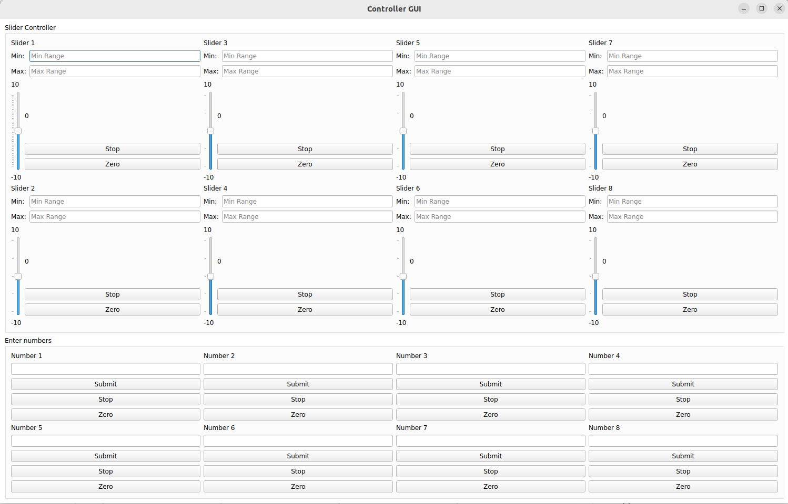

# ROS2 basic GUI with PyQT

updated ver: https://github.com/KimJiHong190/robot_gui_pkg

This repo provides a GUI to easily publish and manage custom messages in ROS2.

You can add and remove the messages you want in controller.py.
